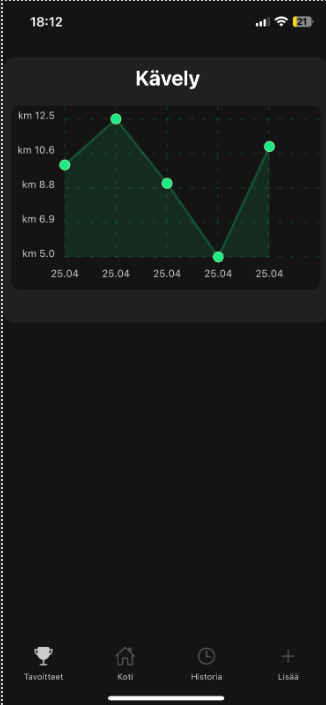
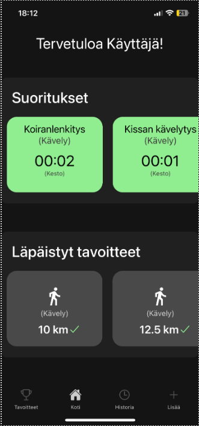
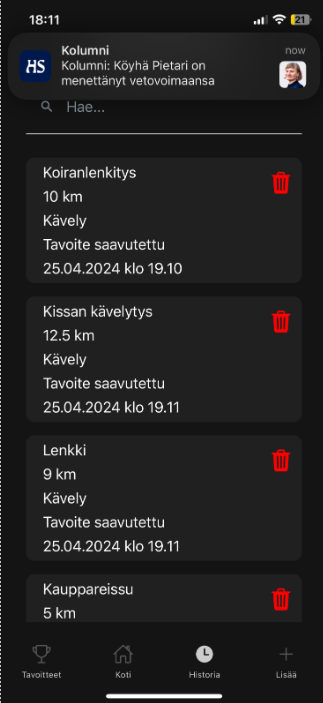
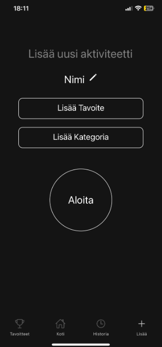

Kuntoilupäiväkirja on ios laitteilla toimiva offline-mobiilisovellus, joka mahdollistaa käyttäjille omien treeniaktiviteettien kirjaamisen, henkilökohtaisten tavoitteiden asettamisen ja visuaalisen palautteen saamisen näiden saavuttamisesta. Sovellus on suunniteltu helppokäyttöiseksi ja keskittyy ydinominaisuuksiin, kuten tehokkaaseen ja turvalliseen aktiviteettien seurantaan.

